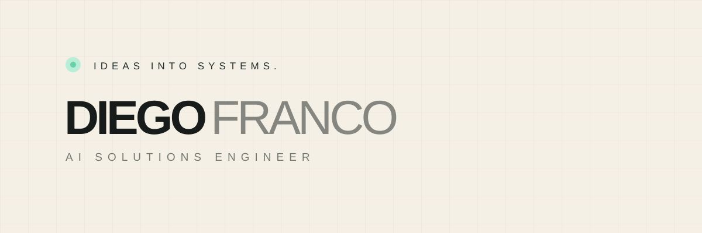

  

## AI Solutions Engineer

I design and build full-stack products where **software, business workflows, automation, data and applied AI** work as one system.

I focus on building digital products around real operational context: clear UX/UI, structured data, secure integrations, AI agents and human-approved actions.

These projects show how I turn business needs into working digital systems. Each one addresses a different operational challenge, from CRM and ERP workflows to e-commerce and customer communication.

| Project | Focus | Access |
|---|---|---|
| **CENIZA — AI-Powered Full-Stack CRM** | Full-stack CRM, operational data, RAG-based AI agent and automation | [Live demo](https://ceniza-crm.vercel.app/) · [Case study](https://www.diegofrancoe.com/proyectos/ceniza) |
| **NAVAL — AI Business Ecosystem / ERP** | Private ERP with production, inventory, purchasing, finance and AI capabilities under active development | [Case study](https://www.diegofrancoe.com/proyectos/naval) |
| **40+ — E-commerce & Automation** | Commerce experience, WhatsApp-assisted sales, secure forms and automated customer communication | [Website](https://cuarentamas.com/) · [Case study](https://www.diegofrancoe.com/proyectos/40-plus) |

| Project | Focus | Access |
|---|---|---|
| **CENIZA — Digital Experience** | Responsive production website focused on visual direction, interaction and brand presentation | [Website](https://cenizaproducciones.com/) |
| **NAVAL — B2B Website** | Responsive B2B product experience, catalog navigation and commercial assistant | [Website](https://www.productosnaval.com/) |
| **Nano — Portfolio** | Personal portfolio experience with responsive visual composition and custom UI | [Website](https://bernardofrancoe.com/) |
| **Diego Franco — Portfolio** | Personal portfolio for AI Solutions Engineering, product work and interactive case studies | [Website](https://www.diegofrancoe.com/) |

> **Privacy by design:** production business data, credentials and sensitive operational systems remain private. Public demos and portfolio evidence are separated from real production information.

### CENIZA — AI-Powered Full-Stack CRM

~~~mermaid
flowchart LR
    SITE[Public website] --> INTAKE[Secure lead intake]
    INTAKE --> CRM[React + TypeScript CRM]

    USER[User] --> CRM
    CRM --> AUTH[Supabase Auth]
    AUTH --> ACCESS[Membership + RLS]
    ACCESS --> DB[(PostgreSQL)]
    ACCESS --> STORAGE[Private Storage]

    DB --> OPS[Live CRM data]
    CRM --> AGENT[AI agent]
    AGENT --> RAG[Hybrid RAG]
    RAG --> GUIDES[Semantic guides]
    RAG --> OPS

    AGENT --> REC[AI recommendation]
    REC --> APPROVAL[Human approval]
    APPROVAL --> EDGE[Edge Function]
    EDGE --> ACTIONS[Controlled actions]

    ACTIONS --> EMAIL[Email]
    ACTIONS --> FOLLOW[Follow-up]
    ACTIONS --> UPDATE[CRM update]
    ACTIONS --> AUDIT[Audit trail]
~~~

CENIZA combines operational CRM data with a context-aware AI layer. The agent retrieves both semantic knowledge and live business data to understand context, generate recommendations and operate across the CRM. It can create and update records, manage follow-ups and execute supported workflows, while sensitive actions remain behind human approval and controlled server-side execution. The public website uses a separate secure intake boundary before information reaches the CRM, keeping public-facing flows separated from private operational data.

### NAVAL — AI Business Ecosystem

~~~mermaid
flowchart LR
    CUSTOMER[Customer] --> WEB[React + Vite B2B website]
    WEB --> CATALOG[Product catalog]
    WEB --> CHAT[Customer chatbot]
    CHAT --> KNOWLEDGE[Product knowledge / RAG]
    CHAT --> API[Serverless API]
    API --> OPENAI[OpenAI]
    API --> MAKE[Make automation]
    MAKE --> EMAIL[Email / notifications]
    API --> ERP[Private ERP]

    USER[Internal user] --> ERP
    ERP --> UI[React + TypeScript ERP]
    UI --> AUTH[Supabase Auth]
    AUTH --> RLS[Membership + RLS]
    RLS --> DB[(Shared Operational DB / PostgreSQL)]

    UI --> ORCH[AI Orchestrator / Internal Agent]
    ORCH --> OPENAI
    ORCH --> COMM[Commercial agent]
    ORCH --> PROD[Production agent]
    ORCH --> BUY[Purchasing agent]
    ORCH --> FIN[Finance agent]

    COMM <--> DB
    PROD <--> DB
    BUY <--> DB
    FIN <--> DB

    COMM <--> ORCH
    PROD <--> ORCH
    BUY <--> ORCH
    FIN <--> ORCH

    ORCH --> TOOLS[Tool calling / ERP services]
    TOOLS --> CONTEXT[Cross-functional context]
    CONTEXT --> OPS[Recommendations + ERP operations]
    OPS --> APPROVAL[Human approval]
    APPROVAL --> EDGE[Supabase Edge Functions]
    EDGE --> ACTIONS[Controlled actions]

    ACTIONS --> RECORDS[Create / update records]
    ACTIONS --> WORKFLOWS[Operational workflows]
    ACTIONS --> ALERTS[Follow-ups / alerts]
    ACTIONS --> AUDIT[Audit trail]
    RECORDS --> DB
    WORKFLOWS --> DB
~~~

NAVAL connects its public B2B website, customer chatbot, automation layer and private ERP as one business ecosystem. The ERP centralizes shared operational data and is designed around specialized AI agents for Commercial, Production, Purchasing and Finance, coordinated by a central internal agent that can operate across supported workflows with human approval for sensitive actions.

NAVAL is currently under development.

### 40+ — E-commerce & Automation

~~~mermaid
flowchart LR
    VISITOR[Visitor] --> WEB[React e-commerce website]
    WEB --> PRODUCT[Product experience]
    WEB --> CHECKOUT[Online purchase flow]
    WEB --> FORM[Ritual 40+ form]

    CHECKOUT --> PAYMENTS[Payment integration layer]
    PAYMENTS --> ORDER[Order / customer data]

    FORM --> VALIDATION[Server validation]
    VALIDATION --> TURNSTILE[Cloudflare Turnstile]
    TURNSTILE --> MAKE[Make automation]

    MAKE --> CUSTOMER[Customer email]
    CUSTOMER --> EBOOK[Ritual 40+ e-book]

    MAKE --> INTERNAL[Internal notification email]
    INTERNAL --> DATA[Customer data / lead details]

    ORDER --> CRM[CRM-ready customer data]
    DATA --> CRM

    CRM -. future integration .-> CUSTOMCRM[Custom CRM]
    PAYMENTS -. extensible .-> GATEWAY[Payment providers]
~~~

40+ combines a public e-commerce experience with automated customer communication and lead capture. Customers can purchase through the website, while the Ritual 40+ flow validates submissions and automatically sends the e-book to the customer and an internal email with the customer's information.

The architecture is designed to remain extensible for payment-provider integrations, a custom CRM and additional commerce or customer-automation workflows.

~~~text
Business problem
      ↓
Product & system architecture
      ↓
UX/UI
      ↓
Full-stack implementation
      ↓
Integrations & automation
      ↓
Applied AI / RAG / tool-enabled workflows
      ↓
Security, testing & human oversight
~~~

  
  
  
  
  
  
  
  
  
  

  <strong>Full-stack products · AI agents · RAG · workflow automation · product UX/UI</strong>

